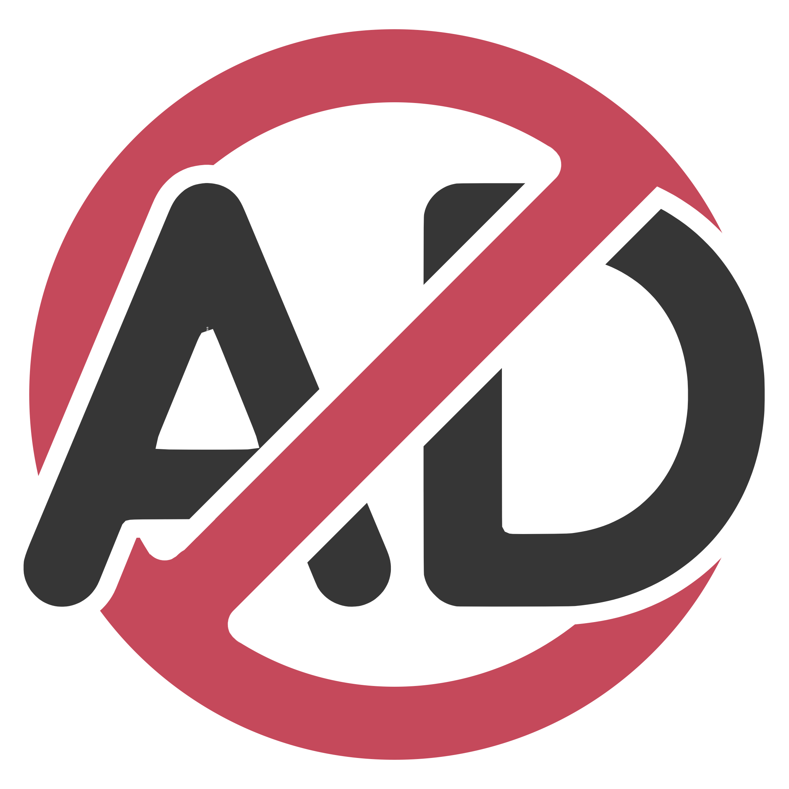

<p align="center">
  
</p>

# Anti-Ads

> Hide page ads and in-player ad UI on **Bilibili** and **Douban**.
>
> 隐藏 **Bilibili** 和 **豆瓣** 的页面广告与播放器内广告 UI。

[](LICENSE)

Companion script to [AntiRecommend](https://github.com/RyanStarFox/AntiRecommend) — install both for a fully cleaned video experience.

与 [AntiRecommend](https://github.com/RyanStarFox/AntiRecommend) 配套使用，同时安装可获得完整的去推荐 + 去广告体验。

---

## Features / 功能

| | English | 中文 |
|---|---|---|
| 🚫 | Hide Bilibili promoted cards & page ads | 隐藏 Bilibili 推广卡片与页面广告 |
| 📢 | Hide Bilibili in-player ad danmaku overlay | 隐藏 Bilibili 播放器内广告弹幕层 |
| 🎬 | Hide Douban Dale ad slots & gray promo blocks | 隐藏豆瓣 Dale 广告位与灰色推广块 |
| ⚡ | Inject CSS at `document-start` — no flicker | 在页面加载前注入 CSS，无闪烁 |
| 👁️ | MutationObserver for SPA dynamic content | 监听 SPA 动态内容，持续生效 |

---

## Supported Sites / 支持站点

| Site / 站点 | Pages / 页面 | Ads |
|---|---|---|
| Bilibili | 首页、搜索、视频、番剧 | ✅ |
| Douban Movie | 首页、条目页 | ✅ |
| Douban Book | 首页、条目页 | ✅ |
| Douban Music | 条目页 | ✅ |
| Douban (www) | 共享广告位 | ✅ |

YouTube support was removed in v1.2.0 — YouTube detects ad-blocking UI changes and may block playback.

YouTube 支持已在 v1.2.0 移除——官方会检测广告拦截并可能限制播放。

---

## Installation / 安装

### Step 1 — Userscript manager / 脚本管理器

| Browser / 浏览器 | Recommended / 推荐 |
|---|---|
| Chrome / Edge / Brave / Opera | [Tampermonkey](https://www.tampermonkey.net/) |
| Firefox | [Tampermonkey](https://addons.mozilla.org/firefox/addon/tampermonkey/) or [Violentmonkey](https://addons.mozilla.org/firefox/addon/violentmonkey/) |
| Safari | [Userscripts](https://apps.apple.com/app/userscripts/id1463298887) |

### Step 2 — Install / 安装

```bash
git clone https://github.com/RyanStarFox/AntiAds.git
```

1. Open your userscript manager dashboard
2. Create a new script and paste the full contents of `anti-ads.user.js`
3. Save and refresh Bilibili / Douban

---

## Usage / 使用方法

No configuration needed — the script runs automatically on matching pages.

无需额外配置，脚本在匹配页面自动生效。

1. Confirm the script is **Enabled / 已启用** in your manager
2. Hard-refresh after install or update: `Cmd+Shift+R` / `Ctrl+Shift+R`
3. **Bilibili**: right-side promoted cards, page ads, and activity bars hidden
4. **Douban**: Dale slots, gray_ad buy/promo blocks, and subject banners hidden; 片单/书单/口碑榜 kept

> Latest version / 当前版本: **v1.2.0**

---

## FAQ / 常见问题

**Q: Why is YouTube no longer supported?**
**问：为什么不再支持 YouTube？**

YouTube shows an ad-blocker warning and may interrupt playback when it detects hidden ad UI. AntiAds no longer matches or modifies YouTube pages.

YouTube 检测到广告 UI 被隐藏时会提示广告拦截器并可能中断播放，因此脚本不再匹配或修改 YouTube 页面。

**Q: Do I still need AntiRecommend?**
**问：还需要安装 AntiRecommend 吗？**

AntiAds only handles ads. For hiding recommendations, disabling autoplay, and URL redirects, install [AntiRecommend](https://github.com/RyanStarFox/AntiRecommend) separately. Both scripts can run together without conflict.

AntiAds 只负责去广告。隐藏推荐、关闭连播、URL 重定向请单独安装 [AntiRecommend](https://github.com/RyanStarFox/AntiRecommend)。两个脚本可同时安装，互不冲突。

---

## License / 许可证

[MIT](LICENSE)
